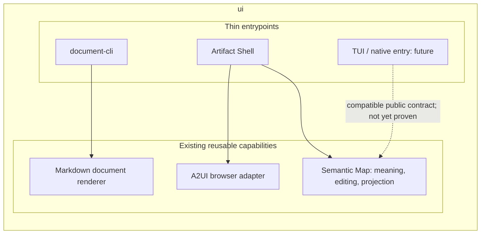

# UI capability and interface boundaries

`ui` owns reusable display, editing and input capabilities, and thin local
entrypoints that use them. It is not restricted to browser rendering.
This is an implementation-boundary explanation, not business/admission authority.
Design context: [ui#312](https://github.com/roccho-dev/ui/issues/312#issuecomment-5906058278).

## Three different questions

| Question | Meaning | Examples, not closed enums |
|---|---|---|
| Who is the view for, and why? | Audience, purpose, disclosure and presentation choices | Operator executing work; customer examining an agreement |
| Which capability is needed? | A contract and the implementation that fulfils it | Document rendering; semantic editing; terminal display/input |
| How is it used? | An entrypoint and suitable environment adapters | Browser shell; local CLI; future TUI/native client |

An audience is not a renderer. A CLI is not a text-only renderer. A TUI is not a
browser in disguise. An interface need not implement every capability.

## Ownership

| Owner | Owns | Does not own |
|---|---|---|
| Upstream source/authority | Business meaning, accepted state and actual disclosure/operation permission | Renderer internals |
| Capability contracts and cores | Their own validation, UI meaning, editing state, projection and history | Another capability's state; external approval or effects |
| Environment adapters | Specific drawing, input and local I/O, with declared dependencies | A second meaning model, second logical history or invented permission |
| Thin entrypoints | Arguments, composition, invoking the capability, presenting its result | A duplicate renderer, universal state store or worker runtime |
| External delivery/execution owner | Provider effects and readback for that workflow | Recreating the UI's semantic processing |

These are responsibilities, not mandatory directories or a new common framework.
Keep an existing owner and public contract when they already implement them.
`packages/**` need not all have identical internal trees or the same language.

Semantic Map includes domain, projection and authoring logic: it is not merely
`render/web`. Its maxGraph/browser adapter is environment-specific. Preserve its
meaning/layout split and the one-editor-owner target of
[ui#207](https://github.com/roccho-dev/ui/issues/207).
A2UI can contain a Semantic Map component, but neither identical payload bytes nor
that nesting is a requirement for every UI consumer.

[ui#212](https://github.com/roccho-dev/ui/issues/212)'s shell/ops equivalence is
about using the same library, not about equal positions in every data flow.
An ops delivery workflow may consume a completed artifact without importing the
projection library. These statements do not contradict each other.

## Data projection is one capability path, not the whole repository

For audience-specific distribution, preserve this separation:

```text
upstream source + externally trusted disclosure rules + audience
  -> permitted data
  -> purpose / view / focus / detail
  -> capability-specific representation
  -> suitable interface or portable output
```

Audience is a required dimension of that distribution contract; its values are
open. `dev`, `client`, `ops` and `team` are examples, not a core enum. The Dev
workspace handles the full source for which its user is authorised; it is not a
peer partial view and its DOM does not become the business source of truth.

The UI may mechanically apply trusted rules, but selecting an audience does not
grant permission. Zoom/focus never grants access. Display-only hiding does not
remove data from exported bytes. Purpose selection must not silently discard a
required qualification, dependency or evidence reference.

One source may supply an operator checklist, a customer agreement sheet and a
team architecture view without duplicating business meaning. The source must
actually contain the required information; missing input is not invented.
Renderer-specific derived structures are allowed. Keep identity, provenance and
meaning rather than forcing every interface to consume one universal UI DSL.

Changing a current audience policy can block new generation or protected access;
it cannot revoke bytes in an already downloaded HTML file. Historical snapshot
replay and current permission to distribute it are different decisions.

Dynamic audience projection, view sharing and portable HTML are tracked in
[ui#311](https://github.com/roccho-dev/ui/issues/311). This document and the local
CLI below do not implement or prove those distribution guarantees.

## An entrypoint need not boot a browser or encode a URL



The arrows above are dependencies, not a universal pipeline.
`artifact-invocation/2` and Artifact Shell remain the request and host contracts
for their existing consumers; they are not prerequisites for every CLI or TTY
library. URL/HTML materialization is optional outside the sharing workflow.
An invocation is input to a runtime, not something inferred from already rendered
DOM. A CLI may return JSON/Markdown/provenance directly.

Human input follows the capability's existing logical operation owner. A local
checkbox, a request, external acceptance and readback are distinct states.
Do not make an extra undo history or external approval path for each interface.

## Implemented example and explicit limits

[document-cli](../apps/document-cli/README.md) calls the existing
`renderMarkdownDocument` with local `document.model.v1` input and an optional
`md.template.block.v1` template. It returns the existing result, including
Markdown, diagnostics and provenance, on stdout. It does not duplicate the
renderer or start Artifact Shell, A2UI, maxGraph, Chrome or a server.

This particular capability uses Node's crypto implementation. Its local CLI is
therefore Node-based. That does **not** establish browser portability of these
module bytes, mandate Node for future native libraries, or prove native/TUI
rendering. Native ABI/build decisions remain local to the relevant capability.

[adrs#423](https://github.com/roccho-dev/adrs/issues/423)'s CDP-to-TTY target has a
different input contract: attach to an existing browser, display its frames and
forward input. It is not required to reinterpret a semantic document first.
The existing Chrome still owns browser state, authentication and lifecycle.
No TUI/TTY stub or capability-complete claim is introduced here.

Standalone shell publication remains a separate expectation under
[adrs#382](https://github.com/roccho-dev/adrs/issues/382), and provider delivery
under [ops#458](https://github.com/roccho-dev/ops/issues/458). Not every use of a UI
library requires an ops workflow, but this does not authorise arbitrary deployment.

## Migration and evidence

The earlier document was a **2026-06-18 browser-only inventory** of several
repositories. Its blanket statements that ui never renders HTML, serves a shell
or validates its own input do not describe the current README and implementation.
The original is retained at this
[exact source revision](https://github.com/roccho-dev/ui/blob/9f38a274acd7e71b6bb4ff0e3e48b4e8e789ee9e/docs/ownership-boundaries.md).
This correction does not assert that every old sibling repo or consumer is retired.

The reusable ability is the owner, not the number of folders. Keep current public
exports, meaning, effects boundaries, licences and consumer inputs until an exact
replacement is demonstrated. No universal core, extra registry, mandatory
all-in-one bundle, new workflow or automatic repo migration follows from this
normalization. The document CLI's tests join the existing base test runner.

A passing entrypoint test proves only that bounded entrypoint. It does not close
ui#207, ui#311, adrs#423, adrs#468, or prove business outcomes or external adoption.
