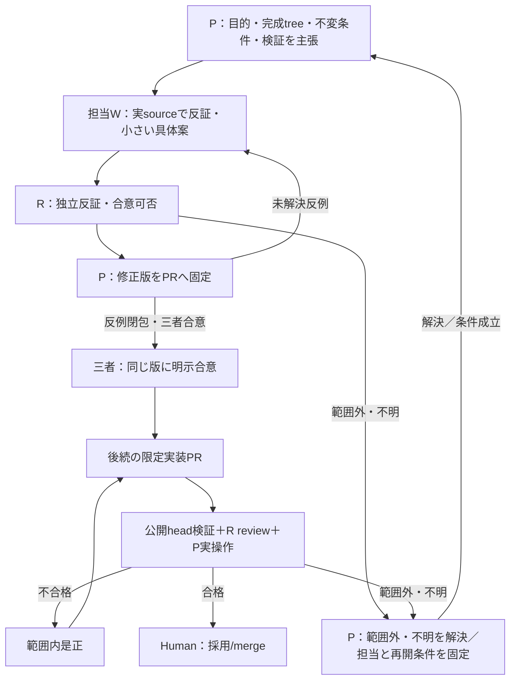

# Atlas基盤：完成形と検証のスコープ案 v4

設計討議文書。合意の現在値はPR本文と、この版を指定した三者コメントで確認する。製品実装の完了証拠ではない。

正本：[配置 #321](https://github.com/roccho-dev/ui/issues/321) / [順序・抽出gate #322](https://github.com/roccho-dev/ui/issues/322) / [合成 #328](https://github.com/roccho-dev/ui/issues/328) / [surface #327](https://github.com/roccho-dev/ui/issues/327)。
規約本文をこの文書へ複製せず、具体的な実装への対応と検証を記す。
実証base：merged [#326](https://github.com/roccho-dev/ui/pull/326)、commit `111d8498dee0aaa314ddfdd2ab0143eeb5c9a693`、tree `c9e88ceb228e803792419b13f4decaae3a46faa8`。

## 目的・担当・許可

少ない概念で再帰的に合成できるui基盤を作り、現在のAtlasがそのconsumerとして成立することを確かめる。完成applicationの所有権移動は抽出gate後の別Issueへ委ねる。

人間はPによるスコープPR作成・最初の主張・rと担当wとのConversationコメントでの反証反復を明示指定した。今回のdraft/doc-only PRとコメント討議はその指定による通常PR-first手順の限定例外。

- P：このCodex root。討議参加・文書更新・参照によるdispatchを兼務。
- r：既存chat `6ac42ac0-36c4-83ee-b8f9-f82b3d69c310`、独立反証。
- w1：既存chat `6ac43a19-e078-83ee-b303-1b16e9b26f89`、現在の#328担当。
- w2：既存chat `6ac43a58-9954-83ee-bfe6-00682d17db9a`、後続#327の担当候補。この討議には追加しない。

共通背景の参照版：adrs `25aba42947c24834943c8b867c2c08edc07b457c` のAGENTS.md / policy/organization.md / policy/execution.md。Userの明示指定を優先する。
今回の作用はこのPRの文書・本文・Conversationコメントだけ。製品source変更、merge、Issue close、policy編集、actor追加、model変更を含めない。ActorはPR/Issue/sourceを自読し、chatにはexact参照だけを渡す。

## Pの採用案

Partは契約を持つ普通の変換関数を基本とする。新Part API、registry、planner、DAG runtime、shared mutable context、汎用Controllerを先に作らない。現在のprojection・surfaceを第二の実装で置き換えない。

次の三つを別々に判断する。

1. 合成できるか：application固有Partでも#328の閉包を証明できる。
2. 共通ownerへ抽出すべきか：契約がapplication非依存であり、既存責務又は実測された再利用圧力が移動先を裏づける時だけ。
3. 物理pathを変えるべきか：責務分離とconsumer移行に具体的効果がある時だけ。

第二のconsumerの存在だけを普遍的な抽出gateにしない。1 consumerでもgeneric責務はあり得るし、2 consumerでもdomain固有の場合がある。
`SemanticProjector`全体はpattern、mount/resource、cache、LOD、budget、map/set/terrain等を持つ既存ownerであり、directory全体を`core`へ移して小Part化したと主張しない。

## 完成形dirtree＋差分予定

以下は現在の実pathへ完成時の責務を対応させたtree。省略した既存consumerは維持する。将来のroot `core/html/svg` は#322のlogical責務を表し、その名前への一括renameはPhase 2/3の合格条件ではない。

```text
domain owner / adrs                     # 意味/state正本。今回変更なし
apps/atlas/                            # FUTURE：gate後の移行Issue。今回範囲外

ui repo
├─ packages/
│  ├─ control/
│  │  ├─ atlas.mjs                     # TEMP application composition。実consumer
│  │  └─ src/
│  │     ├─ live-atlas.mjs             # TEMP producer解釈、currentness、history、audit
│  │     └─ live-atlas-projection.mjs  # TEMP application Parts/paint/LOD
│  │                                   # 初回：既存layout→fitと既存試験を照合。差分0も可
│  ├─ semantic-map/
│  │  ├─ protocol/                    # 既存generic view/data契約
│  │  ├─ projection/                  # 既存projection owner。丸ごとcoreへ移さない
│  │  ├─ surface-runtime.mjs          # composition＋DOM controls＋spatial adapter
│  │  └─ renderer-maxgraph/           # SVG/free geometry/edge/camera。既存実装
│  ├─ a2ui-browser/
│  │  └─ src/
│  │     ├─ render/                   # HTML/DOM flow
│  │     └─ catalog/atlas-stage.mjs    # A2UI橋渡し＋既存native SVG island
│  │                                   # adapter名だけでHTMLと分類しない
│  └─ core-port/src/                  # generic入出力は維持
│     ├─ a2ui-shell-builder.mjs       # mixed責務。sha256/stableJsonも実consumerあり
│     └─ adapters/                   # 個々の責務を確認。名前による一括移動なし
├─ apps/artifact-shell/               # 既存thin composition root。第二hostを作らない
├─ examples/ ＋既存package examples/
│  ├─ control/                       # 実在proofを最小化/再利用
│  ├─ graph・seq・map                 # 実在JSONL/fixture/build入口を再利用
│  ├─ html-a2ui相当                   # 既存DOM-flow proofを再利用
│  └─ atlas相当                       # 必要な最小composition proofだけ
│                                    # application固有意味・live producerを入れない
└─ tests/
   ├─ check-live-atlas.mjs            # 既存実証を優先。未証明の製品不変条件だけ必要時追加
   └─ 既存browser/build/ownership検証  # 変更経路に応じ再実行、最終gateでは全回帰
```

初回#328はevidence-firstとする。現sourceの `layoutTopology` → `layout.world` → `fitCamera` と、既存 `tests/check-live-atlas.mjs` の実証を先に照合する。予定製品差分は0でよい。未証明の製品不変条件があれば、そのassertionだけ最小追加する。既存source/試験で規約が閉じていれば新code/new testなしで成立を記録する。proofだけのproduction wrapper、test-only closure wrapper、移動を作らない。
初回proofだけを#322完了と呼ばない。後続surface境界、最小proof、実Atlas consumer、抽出gateを順に確かめる。後段で実際の抽出が必要なら、その時点のsource/consumer根拠でexact file setを小さく固定してから実装する。初回の仮説を後段のscope許可へ流用しない。

| 段階 | 予定差分・完成証拠 |
|---|---|
| #328 | 実関数・実consumer・既存証拠を照合。未証明invariantだけ必要時追加。既に成立ならzero-diff |
| #327 | DOM flow / free geometryで既存責務を区別。mixed bridge/islandも明示。必要なseamだけ修正 |
| 最小examples | 現proofを再利用し、未証明の組合せだけ最小追加。ディレクトリ数を完成条件にしない |
| Atlas consumer | 根拠のあるPart/surface抽出があれば現Atlasでconsume。同名二重実装・domain逆流を残さない |
| extraction gate | 最終actual treeで構造＋回帰＋consumerを確認。不要ならphysical renameしない |
| apps移行 | gate後に移行Issue新設。今回のsource許可へ含めない |

公開import/export/build URL、Nix配布、CI、artifact-shell、browser fixtureをconsumer棚卸しへ含める。
移動時は実consumer更新又はstatelessな互換exportを選ぶ。互換exportには残るconsumer、単一実装owner、撤去条件を示す。import名が新しくなっただけ、古い実装が別pathに残っただけ、を完成にしない。
既存native SVGを新rendererの導入と扱わず、AtlasのmaxGraphをnative SVGへ置き換えない。

## 数式・コメント

互換契約 `P:A→B`, `Q:B→C`, `R:C→D` の純粋変換について：

```text
compose(P,Q)(x) = Q(P(x))
compose(compose(P,Q),R) ≡ compose(P,compose(Q,R))
compose(id_A,P) ≡ P ≡ compose(P,id_B)
# ≡ は許容入力での観測同値。副作用を持つ処理を再結合しない。
# 合成結果も普通の関数なので、同じ規則で再び合成できる。
# 式は設計則。普通のJS関数合成のidentity/association/closureを再テストしない。
# 独立した理由で実composition実装を導入する時だけ、その実装固有behaviorを検証する。
```

A/B/Cはproduct型・明示した複数引数を含めてよい。fan-out/joinも普通の関数で表す。全Partが読み書きする可変bagにはしない。

```text
layoutTopology : Topology → Layout                  # application Part。generic昇格証拠ではない
fitCamera      : (World, Viewport, margin) → Camera
fitTopology    : (Topology, Viewport) → Camera
  = fitCamera(layoutTopology(topology).world, viewport)
# fitTopologyは式の名前。証明だけのproduction wrapper追加は要求しない。

s  = min(viewport.width/world.width, viewport.height/world.height) * margin
tx = (viewport.width/s - world.width)/2 - world.x
ty = (viewport.height/s - world.height)/2 - world.y
# 入力は既存consumerが渡す有効geometry。新validation wrapperを式のために足さない。
```

契約は既存実行時validation＋明示した関数signatureでよい。既存に拒否契約があればその失敗を保持する。pure関数にないinvalid-input rejectionを捏造せず、新validatorをPart証明の条件へ加えない。
Rendererに渡るscene/paintの既存validationと部分mutation前の拒否は保つ。

Atlasで保持する観測不変条件：

```text
live current = held exists ∧ observations accepted ∧ connected
               ∧ latestAttempt.outcome ∉ {rejected, conflict}
               ∧ 0 <= now-held.asOf <= held.maxAgeMs
lanes(s) = current ? |distinct fresh running Work.id in desc*(s)| : UNKNOWN
position = layout(topology)         # 観測/time/selection/cameraでworld配置を変えない
scene primitives <= 2048
every taskScope at each LOD = one area + one status chip
```

Sample/historyは既存のaccepted observationsとasOf clockの意味で判定する。duplicate/staleはheld鮮度を更新しない。
1論理actor、exact ID/join、4参照種別、履歴gap/eviction、rejected raw audit、hidden selected item、reduced motion、explicit degradeを保持。UNKNOWNをzero/idle、heartbeatをworkと解釈しない。

## 完成検証内容一覧

検証はIssue番号ではなく**変更した実行経路**に比例させる。最終gateの一覧と、初回必須を分ける。下表は計画でありPASS実績ではない。

| 対象 | 自動/独立検証 | P目視・手動操作 | 実施時点 |
|---|---|---|---|
| 合成と製品invariant | 実関数/consumerと既存試験を照合。未証明なら入力非mutation・決定的output・effect境界等の製品assertionだけ追加。普通のJS合成の言語則テストは要求しない | evidence-onlyなら不要。UI経路変更時は同経路を実操作 | 初回#328。zero-diff可 |
| 契約/依存 | 有効入力signature、既存拒否契約があれば同じ拒否、generic層の逆依存なし、新registry/controllerなし | 実装詳細がUser flowに出ない | 初回＋変更時 |
| Surface責務 | 既存DOM nestingとspatial graphを実行。A2UI内SVG islandをHTML判定しない、graph/layoutのDOM再実装なし | HTML検索/InspectorとSVG selection/zoom/pan/Fit | #327＋影響時 |
| 公開consumer | imports、exports、Nix/CI/build入口、artifact-shell、fixtureの実inventory。更新/互換export、単一implementation | 実際の既存公開URLから到達 | 移動/入口変更時 |
| 最小proof | control/graph/seq/map/A2UIを再利用し、未証明compositionだけ追加。atlas proofはapplication意味なし | relevant exampleで1代表操作、読みやすさ | examples段階 |
| Atlas意味 | 既存Live Atlas check・semantic-map suites。all scopes、logical actor、parallel Work.id、refs、selection、history/retarget/gap、exact raw audit | scope→work→actor→target、history選択とretarget | 影響時＋最終 |
| Scale/LOD/layout | 既存300scope fixture、全scope at far/middle/near、coverage、2048budget、観測/time/cameraでworld位置不変 | 1280×800/1440×900、Fit、parallel/blocked。小viewportはexplicit degrade | 影響時＋最終 |
| Live/UNKNOWN | 既存producer＋actual EventSource。accepted、bad mandatory/optional、stale/duplicate、disconnect/reconnect/recover | reloadなしcurrent→UNKNOWN→current、selection/topology保持 | 影響時＋最終 |
| Renderer/a11y | 不正paintの原子性、generic opacity、motion/camera再描画、reduced-motion、hostile label、keyboard | keyboard到達、static status、同操作 | 影響時＋最終 |
| Build/standalone | 既存ESM closure、同module入力でbuilder parity、unresolved importなし、notice/license、新依存なし | 新artifactのHTTP。Windows手動file://は可能時のみ実測 | build影響時＋最終 |
| 公開版一致 | PR base/head/tree/diff、exact公開headでaffected check。sandbox結果は同一性証明又は公開headで再実行 | Pは新headの生成物をUser入口で操作。旧18185artifactを新head証拠にしない | 各実装PR |
| 抽出gate | 合成最終actual treeで#328/#327、minimal proof、現Atlas consumer、意味逆流なし、範囲内残件0 | ownershipを動かす前に現application実操作 | #322最終gate |

evidence-only / zero-diffを有効な初回結論とする。既存実compositionが#328を満たすなら「実装slice」を必須にしない。式だけを証明するlocal fitTopology helper、identity/association test、既存証拠と同じassertionは追加しない。
未証明invariantだけのtest sliceで製品sourceが変わらなければ、全300scope/SSE/browserを初回に重ねない。
`atlas.mjs`のFit等の実経路を変えれば、既存 `tests/check-live-atlas.mjs` と該当browser操作をそのsliceで行う。触れていない経路だけ後段へ置く。
実装前にexact file set、command/required jobs、expected resultをその実装PRへ固定する。新seamを検証する意味ある試験だけ追加し、実装をなぞる重複テストを増やさない。

最終gateでは既存#326 semantic/browser/live/build回帰を省かない。
既知base限界：purpose-visualization hosted Chrome startupは#326と未変更baseでtimeout、PのWindows手動file://は未実施。PASSへ改名しない。changed inputsへ例外を無検証で持ち越さず、oracleを弱めず、blind retryしない。

## 閉包した討議・改善ループ



主張・反証・回答はこのPRのConversationへ直接記録し、role、評価版、根拠、最小修正、残件、合意可否を明示する。chatはexactコメント参照で発火するだけ。経過や相手の本文をchatへ中継しない。
この設計討議の完成条件は、同じ文書版のtree・差分予定・式・検証一覧にP/W/Rが明示合意し、設計のmaterialな未解決反例が0になること。
合意は製品実装開始、merge、Issue close、User最終受容を代行しない。無回答/時間経過を合意にしない。
