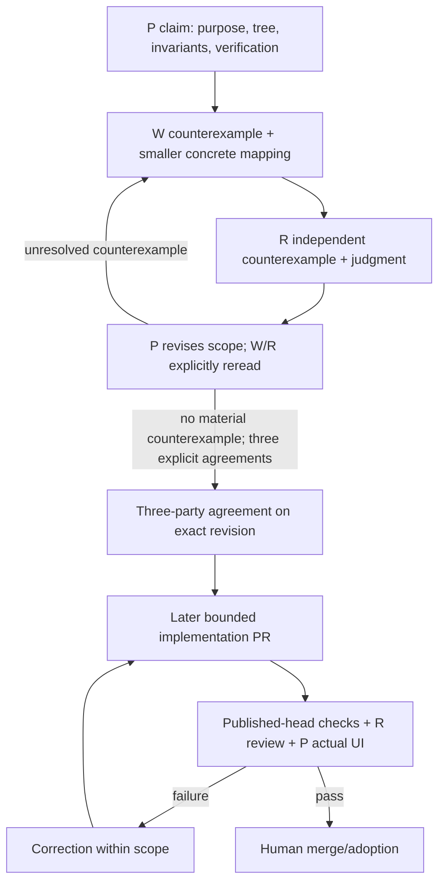

# Atlas foundation — scope and completion proposal

Status: P initial claim / NOT agreed / design discussion only.
Refs: [#321](https://github.com/roccho-dev/ui/issues/321), [#322](https://github.com/roccho-dev/ui/issues/322), [#328](https://github.com/roccho-dev/ui/issues/328), [#327](https://github.com/roccho-dev/ui/issues/327).
Proof baseline: merged [#326](https://github.com/roccho-dev/ui/pull/326), proposals commit `111d8498dee0aaa314ddfdd2ab0143eeb5c9a693`, tree `c9e88ceb228e803792419b13f4decaae3a46faa8`.

## Authorization and participants

The human explicitly requested that P open a scope PR, make the first claim, and iterate claims/counterexamples with r and the responsible w in this PR's Conversation comments. This authorizes a documentation-only scope PR and substantive comments, overriding the ordinary meaningful-product-PR-first/comment-minimization guideline for this discussion. It does not authorize product implementation, merge, Issue close, policy edits, or automatic migration.

P: this Codex root (also handles dispatch). R: existing chat `6ac42ac0-36c4-83ee-b8f9-f82b3d69c310` (title r). Responsible W: existing chat `6ac43a19-e078-83ee-b303-1b16e9b26f89` (title w1), first #328 lane. w2 `6ac43a58-9954-83ee-bfe6-00682d17db9a` is reserved for later #327 ownership, not a fourth participant or simultaneous writer here.

Applicable shared background: adrs `25aba42947c24834943c8b867c2c08edc07b457c`, AGENTS.md and policy/organization.md / policy/execution.md. User's explicit request controls the discussion exception. Actors read Issues/repository themselves; dispatch carries exact references rather than another actor's argument. Existing models are preserved; no inferred provider execution label.

## P claim

Smallness means few concepts and responsibilities, not just short files. A Part is a contracted transform; ordinary function composition is the default. A new Part API, registry, scheduler, planner or universal Controller requires a concrete counterexample showing ordinary composition cannot satisfy the observed contract.

The present source already has semantic-map projection/layout/runtime and two surfaces; do not implement them a second time. Extract only a real transform with a real consumer and evidence. A function wrapper around the entire Atlas application is not evidence of smallness or recursion.

#321 owns where; #322 owns order and extraction gate; #328 owns composition; #327 owns surface choice. This proposal supplies implementation mapping/evidence, not a second rule authority. #328/#327 remain rule Issues; adoption is tracked as #322 phases. Updated #322 order is:
recursive Parts -> surfaces -> minimal examples -> current Atlas consumer -> extraction gate -> later apps migration.

## Completion tree (logical target; actual paths below must be justified)

```text
domain owner / adrs                  # authoritative meaning/state; unchanged
apps/atlas/                         # FUTURE: only after #322 gate + migration Issue
  application composition           # not part of this refactor's completion

ui/
├─ core/                            # NEW logical owner of proven reusable transforms
│  ├─ contracts                     # input/output/constraints; no adapter/domain names
│  └─ Parts                         # ordinary functions; composition returns a Part
├─ html/
│  └─ a2ui/                         # MOVE existing DOM adapter; ordinary DOM flow
├─ svg/
│  └─ maxgraph/                     # MOVE existing spatial adapter; no replacement renderer
├─ examples/
│  ├─ control/                      # minimal executable proof of existing capability
│  ├─ graph/                        # free geometry/edge/camera
│  ├─ seq/                          # existing sequence capability
│  ├─ atlas/                        # generic composition proof, NOT full application
│  ├─ html-a2ui/                     # DOM-flow proof of existing adapter
│  └─ map/                          # existing geographic capability
└─ current Atlas application        # TEMP until extraction gate, current paths retained
   ├─ read model / producer contract
   ├─ application-specific status/ref/history interpretation
   └─ composition of core + HTML + SVG
```

`ui/` denotes the repository, not an extra nested directory. Names in core are responsibilities, not a predeclared file catalog. Keep the current Atlas files in place until Phase 5 proves its consumer boundary. Do not create an empty atlas-app directory or move files just to match the tree.

Concrete migration candidates, requiring W/R source evidence before adoption:

| Existing source | Candidate responsibility / planned difference |
|---|---|
| packages/semantic-map/projection/* and existing view/data contracts | core projection/contract owner; only demonstrated surface-independent transforms move or are extracted |
| packages/a2ui-browser/src/* | html/a2ui implementation; retain generic action/port contracts outside the adapter |
| packages/core-port/src/a2ui-shell-builder.mjs and src/adapters/* | inspect each: move only adapter-specific implementation to html; generic input/output stays generic |
| packages/semantic-map/renderer-maxgraph/* | svg/maxgraph implementation; preserve vendor/license/style and public adapter API |
| packages/control/atlas.mjs | TEMP application composition; later consume Parts and split HTML presentation from spatial projection only where justified |
| packages/control/src/live-atlas.mjs | TEMP application read-model logic; never promote producer/domain interpretation into generic core |
| packages/control/src/live-atlas-projection.mjs | distinguish reusable geometry from Atlas-specific status/refs/work paint; keep latter application-owned |
| apps/artifact-shell/* | existing thin composition root remains; no second host or registry |
| current examples and scripts/build-*.mjs | minimal examples + existing build entry compatibility, no duplicate demo application |
| tests and existing publication consumers | update only affected imports and add boundary/behavior evidence |

Physical relocation is not proof. Transitional exports may preserve existing import URLs but must be stateless and bounded by an explicit consumer inventory. Do not leave two implementations, split meaning by adapter, or silently break independently consumed paths. The candidate file set is not yet agreed; W must name exact initial files, current consumers, dependencies, and smallest independently testable slice.

## Contract equations and invariants

For compatible contracts, let `P:A->B`, `Q:B->C`:

```text
Part(A,B) = { contract: A -> B + constraints, transform: f }
compose(P,Q):A -> C = x => Q(P(x))
compose(compose(P,Q),R) ≡ compose(P,compose(Q,R))
compose(id_A,P) ≡ P ≡ compose(P,id_B)
```

Equality is observable output/error/effect behavior on accepted inputs; stateful effects are not reassociated. Contract mismatch fails before partial renderer mutation. An executable contract may remain existing validation plus a documented function signature: a new metadata wrapper is not mandatory.

```text
projection = composed transforms(data, view input)
surface(projection requirement) =
  HTML                          if ordinary DOM flow suffices
  SVG                           if free geometry / edge / spatial camera is needed
  HTML shell + SVG plane        if both are needed
```

No universal surface router is required. A generic nested tree can use HTML while the Atlas relation/camera plane uses SVG. Geometry and adapter parameters may exist in projection/surface contracts; owning-domain meaning must not depend on adapter names.

Keep #326's behavior:
```text
current = held exists ∧ observations accepted ∧ connected
          ∧ latestAttempt.outcome ∉ {rejected, conflict}
          ∧ 0 <= now-held.asOf <= held.maxAgeMs
lanes(s) = current ? |distinct fresh running Work.id in desc*(s)| : UNKNOWN
position = layout(topology)       # time, observation, selection and camera do not relayout topology
scene primitives <= 2048
scope presence at every LOD = one area + one status chip per taskScope
```
Sample/history use their existing accepted-observation/asOf clock semantics, not the live connection condition. Duplicate/stale input must not refresh accepted freshness. Preserve one logical actor, exact IDs/joins, history gaps, rejected-input audit, selected hidden-item behavior, reduced motion and explicit degrade. UNKNOWN is not zero or idle.

## Completion verification list

These are planned gates, not tests already run on this proposal.

| Gate | Automatic / independent proof | P visual/manual proof |
|---|---|---|
| Part closure/recursion | a real extracted transform + real consumer; compose a composed result again; compatible contracts, mismatch, identity and association where pure; input/effect behavior preserved | compare the smallest example with its direct composition |
| Ownership/import boundary | source/import inventory: core never imports application/adapter; surfaces consume core; app consumes Parts/surfaces; no domain status/reference classification migrated to core | no architectural internals added to user flow |
| Surface rule | executable DOM-flow nesting case and spatial graph case; HTML controls/Inspector/audit remain HTML, maxGraph remains spatial renderer | select/search/Inspector plus graph zoom/pan/Fit from same application |
| Consumer/public compatibility | enumerate current public imports/build entries, update actual consumers or bounded forwarding exports; existing publication/registry generation stays reproducible | existing reachable URLs still open; no fake compatibility claim |
| Minimal examples | reuse existing control/graph/seq/map/A2UI capabilities; each proves a specific contract; examples/atlas uses generic composition, no producer/business logic | one operation per relevant example; labels/controls readable |
| Atlas semantics | existing tests/check-live-atlas.mjs and semantic-map suites; no target-status or observation truth changes; history selection/retarget/gaps, exact raw audit | scope -> work -> actor -> target; old/current revision selection and retarget |
| Scale/LOD/layout | existing 300-scope fixture; all scopes at far/middle/near; exact IDs/coverage; primitive budget; world geometry unchanged during observation/time/camera changes | 1280x800 and 1440x900; far/middle/near/Fit, multi-lane and blocked markers, small viewport explicit degrade |
| Live/UNKNOWN | existing SSE producer + actual EventSource/browser test: accepted, invalid mandatory/optional, stale/duplicate, disconnect, reconnect, recover | current -> UNKNOWN -> current without reload; selection and topology held; no heartbeat-as-work inference |
| Renderer/accessibility | existing renderer/browser regressions; bad paint rejected before mutation; reduced-motion static affordance; hostile labels escaped | controls reachable with keyboard; reduced-motion status readable; unchanged interaction |
| Standalone/build closure | existing build-live-atlas and existing semantic-map builder parity against same module inputs; no unresolved imports/new dependencies; notices/license retained | HTTP actual artifact; local-file route remains separately marked unverified if unavailable |
| Published source identity | verify PR base/head/tree/files and affected CI against actual published head; sandbox-only evidence must tie exactly or rerun | P operates the new built artifact; port18185's old build is not evidence for a new head |
| Extraction gate | compose final actual tree/PR identities; #328 and #327 structure, minimal proofs, current Atlas consumer and no meaning backflow; remaining work zero within refactor scope | application still works before ownership move; migration Issue only after gate |

Use existing test runners and CI first; add only behavior/boundary tests needed for the new seam. Doc-only scope PR needs document consistency and review, not pretend product tests. At implementation time, list exact commands/required jobs and actual run identities for the agreed slice.

Known baseline limits remain explicit: hosted purpose-visualization Chrome startup timed out on both #326 and unchanged base; P's Windows manual file:// route was unavailable. Do not relabel either PASS, weaken an oracle, add blind retries, or carry an exception to changed inputs without review.

## Debate and closed process



All substantive claims/counterexamples/responses are direct PR Conversation comments, with author role, exact proposed revision/head, evidence references, smallest correction, unresolved items and agreement status. R/W do not send arguments to each other's chat. P dispatches exact comment URLs only. Silence or elapsed time never counts as agreement. This design task ends with the agreed current tree, expected differences, equations and verification list; product effects require the next bounded implementation instruction. No merge/close in this discussion.
