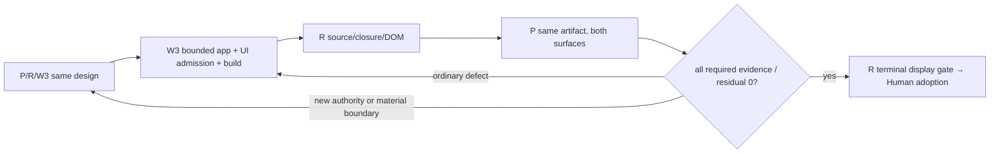

# P design v5 candidate — full display closure

Status: v5 is preserved design history. Current visual candidate: integration.md.
The prior placement is reopened; product implementation remains unstarted.
Source refs: P 6025725543 / R 6025854933 / W3 6025888385 / P 6025902063.
Visual examples: README / view.example.html / captured images.
UI base: 3fd451996d05e304a38be2a6696acb18b3103a37.
Apps base: 2022a8da358979b6360ef06795856b91b157185b.

## Target and boundary
One apps Atlas entry contains Purpose comparison and the existing Activity Atlas.
Purpose-only success is a checkpoint. Full success includes both surfaces and P's
actual product readback. Real OCI collection, all of apps#66, merge and close are
outside this discussion permission.

No new UI renderer, business parser in UI, generic framework, server or dev CI.
Apps owns closure presentation, M/R/E/S comparison, input ordering and context.
Existing UI owns graph/layout/camera/selection and the Activity screen.

## Complete physical tree (+ add / ~ modify / 0 unchanged)
```text
apps/
  flake.nix                                  ~ # single ui admission + atlas-dist
  flake.lock                                 ~ # same declared ui revision
  packages/atlas/
    closure.mjs                              0
    reduce.mjs                               0
    README.md                                ~
    presentation.mjs                         + # validate B/A; graph/detail/path/diff
    web/
      index.html                             + # one app shell, anchors, visible stack
      app.mjs                                + # both mounts, independent context, clocks
      purpose-panel.mjs                      + # controls/details; existing graph surface
    fixtures/
      purpose.jsonl                          0
      current.jsonl                          0
      current.before.jsonl                   + # exact valid before source
      current.replacement.jsonl              + # named independent replacement source
    tests/
      closure.test.mjs                       0
      presentation.test.mjs                  + # meaning/relation/provenance + ID cases
      browser-e2e.mjs                        + # actual composed DOM/interaction
ui production / runtime registry / CI files   0
```

Changed/new apps paths: 11. These are responsibility paths; a concrete source obstruction is reported before
expanding them. purpose-panel separates the actual purpose-surface DOM owner from app composition; no separate builder source is required.

## One actual artifact boundary
Use the single apps ui input, admitted to the above UI base for full composition.
Consume control-ui and semantic-map outputs from the same revision.
Do not mix adopted control with older semantic-map, or add a second permanent UI
input absent a demonstrated incompatibility. Voice's existing consumer behavior
and artifact provenance are affected admission checks, not assumed unchanged.

The single production build is nix build .#atlas-dist. flake.nix owns admission and assembly from actual output roots and explicitly declared inputs; no separate build.mjs is required.
It produces $out/site/index.html, app.mjs, purpose-panel.mjs, all referenced closure/presentation modules, admitted
UI package siblings, embedded or served data, and an actual receipt.
Relative imports resolve inside the artifact; overlapping copied files must have
identical bytes. The mock HTML/images are not product build inputs.
Receipt binds actual app/UI revisions and actual input/reduced/output bytes.
No manually transcribed hash becomes an execution gate.

Activity input is a declared synthetic representative from adopted UI; it is not
real OCI. The adopted UI example is already a ui.liveAtlasHistory.v1 input accepted by loadHistory(); bind that exact input and hash. Do not invent another wrapper codec.

## DOM and lifecycle
```html
<main data-atlas-app>
  <nav><a href="#purpose">Purpose</a><a href="#activity">Activity</a></nav>
  <section id="purpose">
    <header>Purpose before/after, Node / Relation / Source counters and legend</header>
    <div data-purpose-layout>
      <div data-purpose-graph></div>
      <aside>selected fields, Purpose paths, counterpart/tombstone, raw/sources</aside>
    </div>
  </section>
  <section id="activity"><!-- mountAtlasUI owns its DOM --></section>
</main>
```

Both sections are visible full-width vertical blocks. Narrow graph/detail may
stack. No display:none graph, mount/unmount tab cycle, ShadowRoot or iframe is
required. Mount each once at non-zero geometry; use existing fit/selection APIs.
Activity's 100vh screen, search, audit, inspector and history remain intact.
Purpose styles are app-scoped; P checks global UI style interaction.
Activity history/currentness and Purpose comparison are independent.
Context is namespaced by surface + opaque id. No cross-highlight without an
explicit owning link input; owner/scope/label matching is not a link.

## Pure presentation / truthful differences
Validate before and after independently using adopted closure semantics.
M = declared fields excluding typed references and sources.
R = normalized typed reference fields.
E = typed directed relation tuples.
S = normalized sources.
N+/N- are presence; NΔ compares M only; RΔ compares R; E+/- are edges; SΔ is audit.
Do not sum these axes as a fictitious total business change count.
Reference-only next/parents changes are not business meaning mutations.

Projection preserves full business id/label/kind/raw/sources in the app model.
Actual UI ids are bounded (240 chars, reserved @mount/), while business IDs are not.
Across all declared comparison cases, union/sort business IDs and edge tuples;
assign distinct compact UI-only node/root/edge namespaces and keep inverse maps.
The same business ID maps to the same UI id across B/A and case switching.
Selection remains business-id-owned; generic adapter receives regionIds.
Graph captions obey actual UI label limits (120 chars, including decorations),
without broken Unicode; full original labels/fields remain in detail/raw.
Root/edge/node namespaces cannot collide. No ID prefix infers business meaning.
Graph geometry is existing UI's responsibility, not mock coordinates.

Selected missing id remains selected logically: show the other snapshot's
label/kind/fields/raw/sources and explicit "unlisted / reason not provided".
Do not invent deletion/completion/reason. E- uses a valid reconciled replacement
snapshot, never oldReduced + omission under monotonic join.


## Two explicit product comparison cases
Case A: purpose + current.before -> purpose + current (late arrival).
Case B: prior valid snapshot -> purpose + named current.replacement input.
Validate/canonicalize each side independently and bind all input/reduced hashes.
The replacement has its own sourceRef/sourceDigest; no reversal is promoted into
a later source claim and no oldReduced+omission is treated as withdrawal.
N-/E- product proof is part of the same artifact and entry, not a test-only case.
Discussion-only current.replacement.example.jsonl demonstrates the intended
synthetic input; it is not production source or a real business observation.

## Actual generic API
new SemanticDomainStore(createSemanticMap(records))
mountSemanticMapSurface({featureId:'graph',pattern:'graph/1',root,store,mode:'view'})
store.replaceRecords(records); surface.fit()
surface.adapter.setSelection({regionIds:[projectedUiId]})
No repeated mount/unmount is required.


## Activity fixture replay — explicit app bootstrap responsibility
The adopted Activity fixture script is not executed by loadHistory().
web/app.mjs owns a bounded fixture adapter inside the same 11-path tree:
- loadHistory for initial state; mount the existing Activity UI in sample mode;
- consume the adopted finite script with explicit fixture clock/connection;
- use the actual applyEnvelope/setSession/tick seams to publish each step;
- expose an honest fixture replay control in the same product entry;
- accepted -> rejected UNKNOWN -> disconnected UNKNOWN -> reconnect -> accepted recovery.
Do not add a server, codec, generic replay framework or persistent producer.
Purpose comparison cannot advance/change Activity replay state; Activity replay
cannot change Purpose case/selection. Real OCI remains unproven/out of scope.
The actual composed browser/P readback exercises these app controls, not a
test-only direct mutation of internal UI state. UNKNOWN/recovery is not removed
from the completion scope.

## Completion verification
Pure: 7 meanings, all/multiple Purpose roots, late upstream/next, independent B/A,
M/R/E/S, provenance-only/reference-only, N-/E-, injective/collision-safe ids,
no inferred Activity link, raw preservation and existing 112-case invariants.

Artifact: same UI revision, complete actual module/data closure, declared sample
inputs, receipt, no mock/renderer copy, existing voice consumer admission.

Composed browser: both surfaces, non-zero geometry, no style/control overlap,
selection/counterpart, meaningful labels, truthful counters, path/Gap fields,
same-page raw, keyboard navigation, Fit/zoom/pan, independent contexts,
and existing Activity search/audit/history/Inspector/currentness behavior.

P actual readback uses the same product artifact/entry with exact Purpose pair,
Activity sample, viewport, selected surface/id, operation, expectation/actual,
screenshots and PASS/FAIL. Mock images never replace this gate.

## Small closed process


Discussion uses local HTML/captured images/P readback; no CI generation dependency.
Future affected existing checks use the production build; no new dev workflow,
artifact ledger or CI-only alternative page. This document does not start them.
