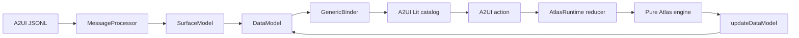

# Purpose Decision Atlas v6 — A2UI refactor

Purpose Atlas v6を、単一HTML内の命令的DOM操作から、**A2UI v0.9 JSONL + `@a2ui/web_core` DataModel / action dispatch**へ全面移行した実装です。

- 目的は地形の主軸として維持
- 責務は別nodeへ分離せず、既存subgraphから再帰集約して外周リングへ投影
- UI構造・DataModel binding・ユーザー操作はA2UI JSONLで宣言
- 地形描画だけを、許可済みcustom catalog componentとしてCanvas内に隔離
- `document.getElementById`、`innerHTML`、グローバルイベント配線を撤去


## 実行

```bash
npm install
npm run dev
```

本番ビルドと全検証:

```bash
npm run verify
npm run preview
```

## 採用バージョン

```text
A2UI protocol       v0.9
@a2ui/web_core      0.10.1
@a2ui/lit           0.10.1
lit                 3.3.3
vite                8.0.16
esbuild             0.28.1
```

`@a2ui/web_core` と `@a2ui/lit` はversioned exportの `/v0_9` からimportしています。

## 構成

```text
public/a2ui/purpose-atlas.surface.jsonl  UI tree / binding / action declaration
src/a2ui/apis.js                         component property schema / action allowlist
src/a2ui/catalog.js                      許可済みcustom component catalog
src/a2ui/validate-messages.js            message / path / catalog security gate
src/runtime/atlas-runtime.js             MessageProcessorとaction reducer
src/domain/atlas-engine.js               純粋なevent replay / layout / responsibility
src/components/atlas-*.js                A2UI Lit component implementations
src/data/atlas-data.json                  base graph + 40 events
scripts/validate-a2ui.mjs                 A2UI schema validation
scripts/verify_a2ui.py                    build/static architecture verification
scripts/browser_verify.py                 real-browser interaction verification
test/*.test.mjs                           domain + A2UI contract tests
evidence/                                 screenshots and verification records
```

## データフロー



## A2UI JSONが担う範囲

`public/a2ui/purpose-atlas.surface.jsonl` が次を宣言します。

1. `createSurface`
2. 6 componentからなる画面構造
3. 全dynamic propertyのDataModel path
4. timeline・mode・zoom・selection・判断記録のaction名とcontext
5. 初期DataModel

例:

```json
{
  "id": "atlas-toolbar",
  "component": "AtlasToolbar",
  "step": {"path": "/ui/step"},
  "viewMode": {"path": "/ui/viewMode"},
  "onStepChanged": {
    "event": {
      "name": "atlas.stepChanged",
      "context": {"step": {"path": "/ui/step"}}
    }
  }
}
```

## DataModel

```text
/
├─ meta
│  ├─ protocol
│  ├─ renderer
│  └─ core
├─ ui
│  ├─ step
│  ├─ playing
│  ├─ viewMode
│  ├─ viewport
│  └─ selection
├─ atlas
│  ├─ nodes / edges
│  ├─ currentPurpose
│  ├─ guard
│  ├─ responsibility
│  ├─ currentComposition
│  └─ cxo
├─ inspector/details
├─ operations
├─ events
└─ toast
```

Canvas上のpan / zoom / selectionも`GenericBinder`が生成するsetterを通して `/ui/*` に書き戻します。runtimeはA2UI actionを受け、純粋domain engineから新しいprojectionを作り、`updateDataModel`でsurfaceへ戻します。

## A2UI actions

| Action | 意味 |
|---|---|
| `atlas.reset` | t0へ戻す |
| `atlas.previous` / `atlas.next` | eventを前後へ送る |
| `atlas.togglePlay` | 40 eventを再生・停止 |
| `atlas.stepChanged` | timeline slider/tickから任意stepへ移動 |
| `atlas.modeChanged` | 統合・目的・責務・不整合表示を切替 |
| `atlas.fit` / `zoomIn` / `zoomOut` | viewport操作 |
| `atlas.select` | node / responsibility ring選択 |
| `atlas.recordMismatch` | ズレとして記録 |
| `atlas.requestOwner` | 担当へ検査依頼 |
| `atlas.holdDecision` | CEO判断待ち |
| `atlas.stepForward` | inspectorから次eventへ進む |
| `atlas.clearSelection` | 選択解除 |

操作記録は `kind + step + owner + guard text` をkeyに重複排除します。

## domain engineの境界

`src/domain/atlas-engine.js` はDOM・Lit・A2UIを参照しません。

```text
base graph + event prefix
  → current graph
  → current terminal purpose
  → support reachability
  → purpose contract guard
  → deterministic meta layout
  → recursive responsibility composition
  → serializable snapshot
```

これにより、表示技術を変更しても40 eventの意味と責務集約を同じテストで守れます。

## custom Canvasを残した理由

A2UI JSONへ任意JavaScriptを埋め込んでいません。地形・Voronoi・責務リング・hit testは、クライアント側で事前登録された `AtlasCanvas` componentだけが実装します。

この境界により、

- agent supplied JSONは既知catalogのcomponentとpropertyだけを使用
- arbitrary script / HTML injectionを禁止
- 高頻度pointer描画をDataModel全体の再生成から分離
- actionと状態は引き続きA2UI経由

を両立しています。

## 検証結果

`npm run verify`:

```text
unit/contract tests       14/14 pass
A2UI JSONL messages       3 valid
A2UI components           6 allowlisted
A2UI actions              15 allowlisted
role-only nodes           0
getElementById            0
innerHTML                 0
production build          pass
```

実ブラウザ検証:

```text
surface creation          pass
next action               pass
responsibility ring       pass
operation dedupe          pass
purpose transition        pass
mobile projection         pass
console errors            0
```

証跡:

- `evidence/verification.json`
- `evidence/clean-install-verification.log`
- `evidence/npm-audit.log`
- `evidence/browser-verification.json`
- `evidence/desktop-t39.png`
- `evidence/mobile-t20.png`

## セキュリティ前提

A2UI JSONは外部入力になり得るため、本実装ではクライアント投入前に以下を検証します。

- catalog IDをPurpose Atlas v6へ固定
- componentを6種のcustom catalogへ限定し、propertyをstrict Zod schemaで検査
- actionを15種へallowlist
- binding pathをAtlas DataModel配下の絶対JSON Pointerへ限定
- message / component / DataModel payloadに上限を設定
- `call` / `functionCall` / undeclared propertyを拒否

本番でagent/server由来JSONを受ける場合は、同じ検証をserver側でも実行し、CSPとaction authorizationを追加してください。

## 移行差分

詳しくは [`docs/A2UI-REFACTOR.md`](docs/A2UI-REFACTOR.md) を参照してください。
